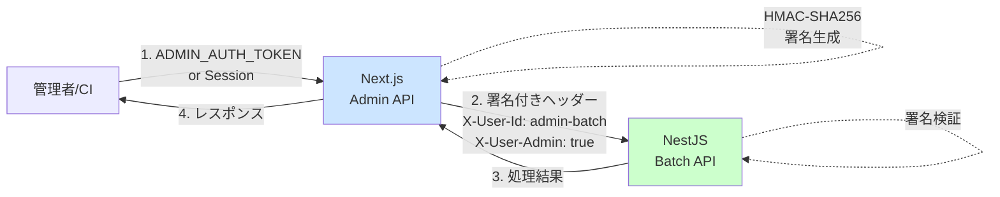

# 管理者用API

## 概要

管理者用のバッチ処理やメンテナンス作業用のAPIエンドポイントです。
すべてのエンドポイントはNext.js経由でアクセスし、内部的にNestJSと通信します。

## 認証方式

### 1. ADMIN_AUTH_TOKENによる認証（推奨：自動化用）

CI/CD、cronジョブ、管理スクリプトからの実行に適しています。

```bash
curl -X POST http://localhost:3000/api/admin/batch/software-design \
  -H "Authorization: Bearer ${ADMIN_AUTH_TOKEN}" \
  -H "Content-Type: application/json"
```

### 2. セッションによる認証（管理画面用）

管理者アカウントでログイン済みの場合、セッションクッキーで認証されます。

```javascript
// 管理画面からの実行例
fetch('/api/admin/batch/software-design', {
  method: 'POST',
  credentials: 'same-origin', // セッションクッキーを送信
  headers: {
    'Content-Type': 'application/json',
  },
})
```

## エンドポイント

### POST /api/admin/batch/software-design

最新のSoftware Design情報をテンプレートとして追加します。

**リクエスト:**
```http
POST /api/admin/batch/software-design
Authorization: Bearer ${ADMIN_AUTH_TOKEN}
Content-Type: application/json
```

**レスポンス（成功）:**
```json
{
  "success": true,
  "message": "Batch job executed successfully",
  "data": {
    "success": true,
    "message": "Latest Software Design added",
    "data": {
      "id": 123,
      "title": "Software Design 2024年1月号",
      // ...
    }
  }
}
```

**レスポンス（既に存在）:**
```json
{
  "success": true,
  "message": "Batch job executed successfully",
  "data": {
    "success": true,
    "message": "Latest Software Design already exists",
    "data": {
      "id": 123,
      "title": "Software Design 2024年1月号",
      // ...
    }
  }
}
```

**エラーレスポンス:**
```json
{
  "error": "Forbidden",
  "message": "Admin access required"
}
```

## セキュリティアーキテクチャ



## 環境変数の設定

### Next.js側 (.env.local)
```env
# 管理者用APIトークン
ADMIN_AUTH_TOKEN=your-secure-admin-token

# 内部通信用（既存）
NEXTAUTH_SECRET=your-nextauth-secret
NESTJS_GRAPHQL_ENDPOINT=http://localhost:4000/graphql
```

### NestJS側 (.env)
```env
# 署名検証用（Next.jsと同じ値）
NEXTAUTH_SECRET=your-nextauth-secret
```

## 使用例

### 1. curlでの実行

```bash
# 環境変数を設定
export ADMIN_AUTH_TOKEN="your-secure-admin-token"

# バッチ実行
curl -X POST http://localhost:3000/api/admin/batch/software-design \
  -H "Authorization: Bearer ${ADMIN_AUTH_TOKEN}" \
  -H "Content-Type: application/json" \
  -v
```

### 2. GitHub Actionsでの定期実行

```yaml
name: Update Software Design Template

on:
  schedule:
    - cron: '0 0 1 * *' # 毎月1日0時
  workflow_dispatch: # 手動実行も可能

jobs:
  update:
    runs-on: ubuntu-latest
    steps:
      - name: Call Admin API
        env:
          ADMIN_AUTH_TOKEN: ${{ secrets.ADMIN_AUTH_TOKEN }}
        run: |
          curl -X POST https://your-app.com/api/admin/batch/software-design \
            -H "Authorization: Bearer ${ADMIN_AUTH_TOKEN}" \
            -H "Content-Type: application/json" \
            --fail
```

### 3. Node.jsスクリプトでの実行

```javascript
const ADMIN_AUTH_TOKEN = process.env.ADMIN_AUTH_TOKEN;

async function updateSoftwareDesign() {
  const response = await fetch('http://localhost:3000/api/admin/batch/software-design', {
    method: 'POST',
    headers: {
      'Authorization': `Bearer ${ADMIN_AUTH_TOKEN}`,
      'Content-Type': 'application/json',
    },
  });
  
  if (!response.ok) {
    throw new Error(`Error: ${response.status} ${response.statusText}`);
  }
  
  const result = await response.json();
  console.log('Success:', result);
}

updateSoftwareDesign().catch(console.error);
```

## トラブルシューティング

### 403 Forbidden エラー

**原因1**: ADMIN_AUTH_TOKENが正しくない
```bash
# 環境変数を確認
echo $ADMIN_AUTH_TOKEN

# .env.localファイルを確認
cat apps/web/.env.local | grep ADMIN_AUTH_TOKEN
```

**原因2**: Authorizationヘッダーの形式が正しくない
```bash
# 正しい形式
Authorization: Bearer your-token-here

# よくある間違い
Authorization: your-token-here  # Bearerが抜けている
Authorization: bearer your-token-here  # 小文字のbearer
```

### 500 Internal Server Error

**原因**: NEXTAUTH_SECRETが設定されていない
```bash
# 両方のアプリで同じ値が設定されているか確認
# Next.js側
cat apps/web/.env.local | grep NEXTAUTH_SECRET

# NestJS側  
cat apps/api/.env | grep NEXTAUTH_SECRET
```

## セキュリティ上の注意

1. **ADMIN_AUTH_TOKENの管理**
   - 強力なランダム文字列を使用（最低32文字以上）
   - 定期的にローテーション
   - 環境変数やシークレット管理サービスで管理
   - コードにハードコードしない

2. **アクセス制限**
   - 本番環境では特定のIPアドレスからのみアクセス可能にする
   - Rate Limitingを適用
   - アクセスログを記録

3. **監査ログ**
   - すべての管理者API呼び出しをログに記録
   - 誰が、いつ、何を実行したかを追跡可能にする